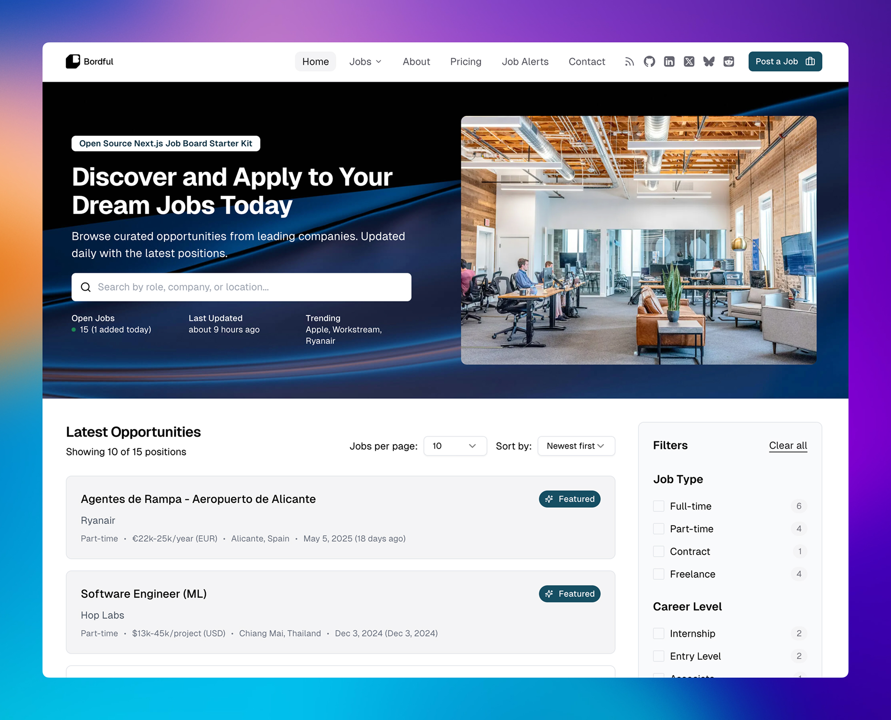
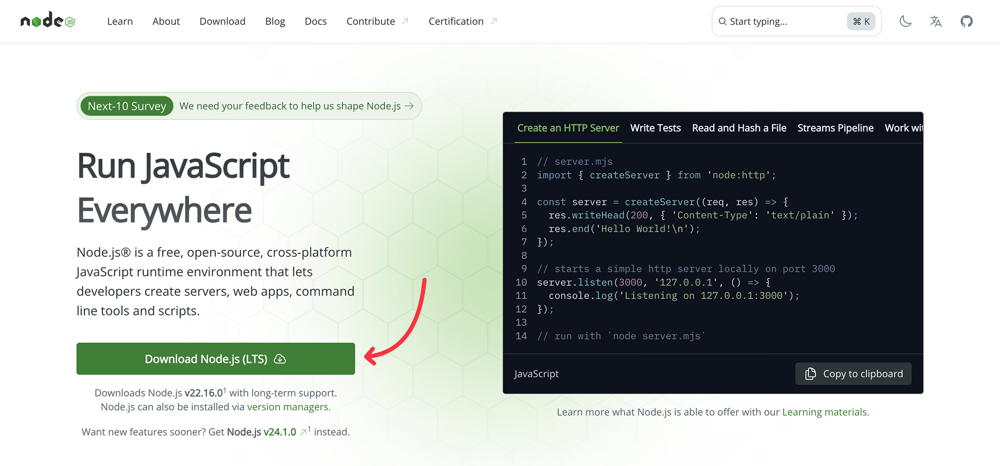
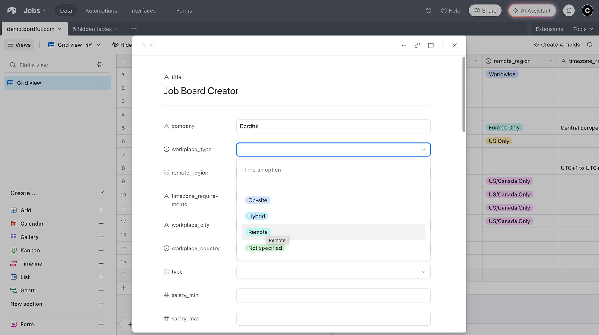

# Bordful: Open-Source Job Board Software

Bordful is a modern, minimal job board software built with Next.js, Tailwind CSS, and 
Airtable. Features static generation, client-side search, and a clean customizable UI.

**Create a professional job board in 5 minutes** - no coding experience required! Bordful lets you build a job board like Indeed or AngelList, customized for your brand.

**Perfect for:** Startups, agencies, communities, or anyone who needs to hire people.

## What You'll Build

By following this guide, you'll have a fully functional job board website with:
- Job listings with search and filters
- Mobile-responsive design
- SEO optimization for Google visibility
- Admin dashboard through Airtable

**Live Demo:** [See Bordful in action](https://demo.bordful.com)



## Why Bordful?

- **Modern Tech Stack:** Built with Next.js, Tailwind CSS, and Airtable for a fast, flexible, and easy-to-manage job board.
- **Comprehensive SEO:** Rich schema.org JobPosting data, automatic XML sitemaps, and more to maximize visibility.
- **Highly Customizable:** Easily tailor the theme, layout, navigation, hero section, and every other aspect to match your brand.
- **Real-time Updates:** Leverages Next.js Incremental Static Regeneration (ISR) to keep job listings fresh without manual rebuilds.
- **User-Friendly:** Clean UI with customizable fonts, client-side search, rich text support for job descriptions, and smart pagination.
- **Full-Featured:** Packed with features like job alerts, multi-currency salary support, advanced filtering, and RSS feeds.

Explore all features in detail in our [Bordful Features Guide](/docs/guides/features.md).

## Getting Started

### 5-Minute Quick Start

Get your Bordful job board up and running in just 5 minutes with this step-by-step guide:

#### Prerequisites (2 minutes)

**1. Install an AI Code Editor (Highly Recommended)**
- **[Cursor](https://cursor.com/)** - AI-powered code editor with built-in chat
- **[Windsurf](https://windsurf.com/refer?referral_code=d886df4b0e)** - Agentic AI coding assistant
- **Why?** These editors will help you customize your job board with AI assistance, even if you're not a developer!

**2. Install Node.js (Required)**

**Easy Method - Download Installer:**
1. Go to [nodejs.org](https://nodejs.org/)
2. Download the LTS version (recommended for most users)
3. Run the installer and follow the prompts



**Advanced Method - Command Line:**
```bash
# On macOS (if you have Homebrew)
brew install node

# On Windows (if you have Chocolatey)
choco install nodejs
```

**3. Verify Installation**
Open your Terminal (Mac) or Command Prompt (Windows) and run:


```bash
node --version  # Should show v18+ or higher
npm --version   # Should show 8+ or higher
```

✅ **Success Check:** If you see version numbers, you're ready to continue!

#### Step 1: Get the Code (1 minute)

**Option A: Using GitHub's Web Interface (No Command Line Required)**
1. Go to [GitHub Import](https://github.com/new/import)
2. Enter repository URL: `https://github.com/craftled/bordful`
3. Choose your username and repository name (e.g., `my-job-board`)
4. Set visibility to "Private" (recommended)
5. Click "Begin import"
6. Once complete, click "Clone or download" → "Download ZIP"
7. Extract the ZIP file to your desired folder
8. Open Terminal/Command Prompt in that folder and run: `npm install`

✅ **Benefits**: Private by default, no Git knowledge required, ready for Vercel deployment

**Option B: Using Command Line (For Developers)**
```bash
# Clone the repository
git clone https://github.com/craftled/bordful
cd bordful

# Install dependencies
npm install
```

> 💡 **Tip**: Option A is perfect if you're not comfortable with Git or want to keep your code private from the start.

#### Step 2: Set Up Airtable Database (2 minutes)

**What is Airtable?** It's like a smart spreadsheet that will store your job listings. Think of it as your job board's database, but easier to use than Excel.

**Option A: Use Our Template (Recommended)**
1. Click this link: [Bordful Airtable Template](https://airtable.com/apprhCjWTxfG3JX5p/shrLqfxgbensCY393)
2. Click "Use this data" to add it to your Airtable workspace
3. **Find your Base ID:** Look at the URL in your browser - it will look like `https://airtable.com/appABC123DEFGHIJK/...`
4. Copy the part that starts with `app` (e.g., `appABC123DEFGHIJK`) - this is your Base ID


✅ **Success Check:** You should see a table with sample job listings and fields like "Title", "Company", "Status", etc.

**Option B: Create Your Own**
- See our [Airtable Setup Guide](/docs/getting-started/airtable-setup.md) for detailed instructions

#### Step 3: Get Your Airtable API Token (1 minute)

1. Go to [Airtable Tokens](https://airtable.com/create/tokens)
2. Click "Create new token"
3. Give it a name like "Bordful Job Board"
4. Add these scopes: `data.records:read`, `data.records:write`
5. Add your base from Step 2
6. Click "Create token" and copy the token (starts with `pat...`)

#### Step 4: Configure Environment Variables (1 minute)

**What are environment variables?** They're like secret settings that tell your job board how to connect to Airtable. Think of them as your app's private configuration.

**Step 4a: Copy the template file**
```bash
# Copy the example file to create your environment file
cp .env.example .env
```

**Step 4b: Edit your settings**
You need to edit the `.env` file with your actual values. Here's how:

**On Mac:** Open the file with TextEdit or your AI editor (Cursor/Windsurf)
**On Windows:** Open the file with Notepad or your AI editor (Cursor/Windsurf)

Replace the placeholder values with your real information:

```env
# REQUIRED: Your application URL
NEXT_PUBLIC_APP_URL=http://localhost:3000

# REQUIRED: Airtable credentials (from steps 2 & 3)
AIRTABLE_ACCESS_TOKEN=pat_your_actual_token_here
AIRTABLE_BASE_ID=app_your_actual_base_id_here
AIRTABLE_TABLE_NAME=Jobs

# OPTIONAL: Email provider for job alerts (you can add this later)
EMAIL_PROVIDER=encharge
ENCHARGE_WRITE_KEY=your_encharge_key_here
```

✅ **Success Check:** Your `.env` file should have real values (starting with `pat_` and `app_`) instead of placeholder text.

> ⚠️ **IMPORTANT**: Never share your `.env` file or commit it to Git! It contains your secret keys.

#### Step 5: Start Your Job Board (30 seconds)

```bash
# Start the development server
npm run dev
```

🎉 **That's it!** Visit [http://localhost:3000](http://localhost:3000) to see your job board in action.

**What you should see:**
- A homepage with job listings (from your Airtable template)
- Search and filter functionality
- Clean, professional design


✅ **Success Check:** If you see job listings on your homepage, congratulations! Your job board is working.

❌ **Not working?** Jump to [Troubleshooting](#troubleshooting) below.

### What You Get Out of the Box

- ✅ Fully functional job board with search and filtering
- ✅ Responsive design that works on all devices
- ✅ SEO-optimized with automatic sitemaps
- ✅ RSS feeds for job listings
- ✅ Admin-friendly Airtable interface for managing jobs
- ✅ AI-assisted customization with Cursor/Windsurf editors

### Next Steps

1. **Add Your First Job**: 
   - Go to your Airtable base
   - Click the "+" button to add a new row
   - Fill in: Title, Company, Description, Status (set to "Published")
   - Refresh your job board to see it appear!



2. **Customize Your Brand**: 
   - Copy `config/config.example.ts` to `config/config.ts` and customize
   - 💡 **Pro Tip**: Open the project in Cursor/Windsurf and ask the AI: "Help me customize the colors and branding for my job board"
3. **Set Up Job Alerts**: Add email provider credentials to enable job alert subscriptions
4. **Deploy to Production**: See our [Deployment Guide](#deployment-to-vercel) below

### Deployment to Vercel (Production)

Ready to go live? Deploy to Vercel in 3 steps:

#### Step 1: Prepare for Deployment

```bash
# Test your build locally first
npm run build
npm run start
```

#### Step 2: Deploy to Vercel

**If you used Option A (GitHub Import) in Step 1:**
1. Your code is already on GitHub - skip to step 2!

**If you used Option B (Command Line) in Step 1:**
1. Push your code to GitHub (without the `.env` file, `.gitignore` file already ignores it)

**For everyone:**
2. Go to [Vercel](https://vercel.com) and sign in with GitHub
3. Click "New Project" and import your GitHub repository
4. Vercel will auto-detect it's a Next.js project

#### Step 3: Add Environment Variables to Vercel

1. In your Vercel project dashboard, go to "Settings" → "Environment Variables"
2. Add these variables one by one:

```
NEXT_PUBLIC_APP_URL = https://your-domain.vercel.app
AIRTABLE_ACCESS_TOKEN = pat_your_token_here
AIRTABLE_BASE_ID = app_your_base_id_here
AIRTABLE_TABLE_NAME = Jobs
```

3. Click "Deploy" and your job board will be live!

### Troubleshooting

**Jobs not showing up?**
- Check your Airtable base has jobs with `status` field set to "Published"
- Verify your `AIRTABLE_ACCESS_TOKEN` and `AIRTABLE_BASE_ID` are correct in `.env`

**`npm install` not working?**
- Make sure Node.js is installed: run `node --version`
- Navigate to the correct folder before running the command
- On Windows, try running Command Prompt as Administrator

**Can't open Terminal/Command Prompt?**
- **Mac:** Press `Cmd + Space`, type "Terminal", press Enter
- **Windows:** Press `Windows key`, type "Command Prompt", press Enter

**Need help?** Check our [Installation Guide](/docs/getting-started/installation.md) for detailed instructions.

### AI-Powered Customization

With [Cursor](https://cursor.com/) or [Windsurf](https://windsurf.com/refer?referral_code=d886df4b0e) AI editors, you can easily customize your job board.


Try these prompts:

**🎨 Change Colors:**
```
"Help me change the primary color scheme to match my company brand. 
My brand colors are [your colors]. Show me which files to edit."
```

**📝 Update Content:**
```
"I want to change the homepage hero text and add my company name. 
Can you help me find and update the relevant text?"
```

**🚀 Fix Deployment Issues:**
```
"I'm getting this error when deploying to Vercel: [paste error]. 
Can you help me fix it?"
```

> 💡 **Pro Tip:** Always describe what you want to achieve rather than asking for specific code!

### Environment Variables Explained

| Variable                | Required | Description              | Example                    |
| ----------------------- | -------- | ------------------------ | -------------------------- |
| `NEXT_PUBLIC_APP_URL`   | ✅ Yes    | Your website URL         | `https://jobs.company.com` |
| `AIRTABLE_ACCESS_TOKEN` | ✅ Yes    | Your Airtable API token  | `pat_abc123...`            |
| `AIRTABLE_BASE_ID`      | ✅ Yes    | Your Airtable base ID    | `appABC123...`             |
| `AIRTABLE_TABLE_NAME`   | No       | Table name in Airtable   | `Jobs` (default)           |
| `EMAIL_PROVIDER`        | No       | Email service for alerts | `encharge`, `mailchimp`    |
| `ENCHARGE_WRITE_KEY`    | No       | Encharge API key         | For job alert emails       |

For a complete list of all supported environment variables, see the [Environment Variables Guide](/docs/reference/environment-variables.md).

## Dive Deeper: Features & Documentation

Bordful is packed with features. Explore the documentation to learn more:

- **Core Functionality & Guides:** Understand Bordful's capabilities. ([Core Features](/docs/guides/core-features.md), [All Guides](/docs/guides/index.md))
- **Customization:** Tailor the look, feel, and functionality. ([Customization Guide](/docs/guides/customization.md), [Theming](/docs/guides/theming-customization.md), [Hero Section](/docs/guides/hero-section.md), [Navigation](/docs/guides/navigation.md), [Footer](/docs/guides/footer.md))
- **SEO & Content:** Maximize visibility with built-in SEO tools. ([Schema Implementation](/docs/advanced/schema-implementation.md), [Sitemaps](/docs/reference/sitemap-generation.md), [Robots.txt](/docs/reference/robots-generation.md), [RSS Feeds](/docs/reference/rss-feed-system.md), [FAQ System](/docs/reference/faq-system.md))
- **Data & Backend:** Learn about Airtable integration and data handling. ([Airtable Setup](/docs/getting-started/airtable-setup.md), [Data Revalidation (ISR)](/docs/advanced/data-revalidation.md))
- **Advanced Topics:** For developers looking to extend Bordful. ([Script Management](/docs/advanced/script-management.md), [Email Integration](/docs/guides/email-integration.md), [Salary Structure](/docs/reference/salary-structure.md), [Language Support](/docs/reference/language-system.md))

For a full overview of all documentation, visit the [Documentation Hub](/docs/README.md).

## Project Structure

```
app/
  layout.tsx              # Root layout with Geist font
  page.tsx               # Home page with job listings
  globals.css            # Global styles
  sitemap.ts             # Dynamic sitemap generation
  robots.ts              # Dynamic robots.txt generation
  not-found.tsx          # 404 page
  favicon.ico            # Favicon route handler
  jobs/
    [slug]/
      page.tsx           # Individual job page (SEO-friendly URLs)
    [category]/          # Category-based job listings
    language/[language]/ # Language-filtered job listings
    level/[level]/       # Experience level filtered listings
    location/[location]/ # Location-filtered job listings
    type/[type]/         # Job type filtered listings
    page.tsx             # Main jobs listing page
    not-found.tsx        # Jobs-specific 404 page
  api/
    subscribe/
      route.ts           # Job alerts subscription endpoint
    og/
      route.tsx          # General Open Graph image generation
      jobs/[slug]/
        route.tsx        # Individual job OG image generation
  about/
    page.tsx             # About page
  contact/
    page.tsx             # Contact page
  faq/
    page.tsx             # FAQ page
  pricing/
    page.tsx             # Pricing page
  job-alerts/
    page.tsx             # Job alerts subscription page
  changelog/
    page.tsx             # Changelog page
  terms/
    page.tsx             # Terms of service
  privacy/
    page.tsx             # Privacy policy
  feed.xml/
    route.ts             # RSS feed generation
  atom.xml/
    route.ts             # Atom feed generation
  feed.json/
    route.ts             # JSON feed generation

lib/
  utils.ts               # Main utility functions
  db/
    airtable.ts          # Airtable integration and salary formatting
  utils/
    formatDate.ts        # Date formatting utilities
    markdown.ts          # Markdown processing
    metadata.ts          # SEO metadata generation
    slugify.ts           # URL slug generation
    colors.ts            # Color utilities
    fonts.ts             # Font utilities
    filter-jobs.ts       # Job filtering logic
  config/
    routes.ts            # Route configuration
    index.ts             # Main configuration exports
  constants/             # Application constants
  email/
    index.ts             # Email provider exports
    types.ts             # Email type definitions
    providers/           # Email provider integrations
  hooks/                 # Custom React hooks
  providers/             # Context providers

components/
  ui/
    job-details-sidebar.tsx    # Job details sidebar
    post-job-banner.tsx       # Post job promotion banner
    similar-jobs.tsx          # Similar jobs suggestions
    job-filters.tsx           # Job search and filter UI
    job-search-input.tsx      # Search input component
    job-badge.tsx             # Job category/type badges
    pagination-control.tsx    # Pagination controls
    nav.tsx                   # Navigation component
    footer.tsx                # Footer component
    hero-section.tsx          # Homepage hero section
    breadcrumb.tsx            # Breadcrumb navigation
    # ... and many more UI components
  jobs/
    JobCard.tsx               # Job listing card
    JobsLayout.tsx            # Jobs page layout
    JobListings.tsx           # Job listings container
    CompactJobCard.tsx        # Compact job card variant
  home/                       # Homepage-specific components
  contact/                    # Contact page components
  job-alerts/                 # Job alerts components
  analytics/                  # Analytics components
  server/                     # Server-side components

config/
  config.example.ts           # Example configuration file
  index.ts                    # Configuration exports
  README.md                   # Configuration documentation

hooks/
  use-toast.ts                # Toast notification hook

public/
  assets/                     # Static assets
    social/                   # Social media assets
  images/                     # Image files
  og-images/                  # Open Graph images
  avatars/                    # User avatar images
  # Various image files and SVG icons
```

## Salary Structure

Bordful includes a sophisticated salary handling system with multiple currencies and formats:

- Support for 50+ global currencies and cryptocurrencies with proper symbols (₿, Ξ)
- Smart currency display with intelligent spacing based on currency type
- Consistent and readable salary ranges with compact formatting (e.g., "$50k - $75k")
- Multiple time units (hour, day, week, month, year, project)
- Optional currency code display for international clarity
- Intelligent salary sorting with normalization across currencies and time periods
- Customizable display options and formatting preferences

For detailed documentation on the salary structure, see [Salary Structure](/docs/reference/salary-structure.md).

## Pagination, Sorting, and URL Parameters

Bordful includes a comprehensive pagination and sorting system with powerful URL parameter support:

- URL-based pagination for better UX and SEO
- Configurable items per page (10, 25, 50, 100)
- Multiple sorting options (newest, oldest, salary)
- Comprehensive URL parameter system for all filters and settings
- Elegant pagination UI with intelligent page number display
- Complete state persistence through URL parameters

For detailed documentation on pagination, sorting, and URL parameters, see [Pagination, Sorting, and URL Parameters](/docs/reference/pagination-sorting.md).

## Sitemap Generation

Bordful automatically generates a comprehensive XML sitemap at `/sitemap.xml` that enhances your job board's visibility to search engines:

- SEO-friendly URLs with descriptive slugs for all job listings
- Dynamic updates through Incremental Static Regeneration (ISR)
- Intelligent priority levels (1.0 for homepage, 0.9 for featured jobs, etc.)
- Appropriate change frequencies for different content types
- Automatic inclusion of all job listings and category pages
- Zero-maintenance implementation with 5-minute revalidation

For detailed documentation on sitemap generation, see [Sitemap Generation](/docs/reference/sitemap-generation.md).

## RSS Feed System

Bordful includes a comprehensive RSS feed system that allows users to subscribe to job listings in multiple formats:

- Support for RSS 2.0, Atom, and JSON Feed formats
- Rich job content with customizable preview length
- Auto-discovery links for feed readers
- Navigation and footer integration
- Full configuration control via config file

For detailed documentation on the RSS Feed System, see [RSS Feed System](/docs/reference/rss-feed-system.md).

## Robots.txt Generation

Bordful automatically generates a comprehensive robots.txt file at `/robots.txt` that helps search engines understand which parts of your site to crawl:

- Dynamic generation using Next.js's Metadata API
- Customizable crawling rules for different user agents
- Protected routes to prevent crawling of admin and private areas
- Automatic sitemap integration for better indexing
- Canonical host definition to prevent duplicate content issues

For detailed documentation on robots.txt generation, see [Robots.txt Generation](/docs/reference/robots-generation.md).

## Email Provider Integration

Bordful includes a flexible email provider system for handling job alert subscriptions. This allows users to subscribe to receive notifications when new jobs are posted.

- Server-side API route for secure handling of subscription data
- Multiple configuration options (environment variables or config file)
- Enhanced data collection for better targeting
- Support for Encharge with more providers planned
- Rich segmentation data for targeted email campaigns

For comprehensive documentation on email provider integration, see [Email Provider Integration](/docs/guides/email-integration.md).

## Customization

Bordful is designed to be highly customizable, allowing you to tailor your job board to match your brand identity and specific requirements.

Key customization options include:

- **Styling**: Configure Tailwind CSS theme, global styles, and component-specific styling.
- **Script Management**: Add analytics, tracking, or any third-party scripts with optimized loading strategies.
- **Data Source**: Modify or replace the Airtable implementation with your preferred database.
- **Theme Customization**: Set colors, typography, and other design elements through configuration.
- **Component Customization**: Modify specific components to match your requirements.

For comprehensive customization documentation, including detailed examples and best practices, see our [Customization Guide](/docs/guides/customization.md).

## Deployment

Bordful can be deployed to various platforms, with Vercel being the recommended option due to its excellent support for Next.js applications.

For comprehensive deployment instructions, including local build verification and platform-specific guides for Vercel, Netlify, and Docker, see our [Deployment Guide](/docs/getting-started/deployment.md).

## Contributing

Contributions are welcome! Please feel free to submit a Pull Request.

## License

MIT License - feel free to use this for your own job board! 100% free for personal and commercial use.

## Support

If you find this helpful, please ⭐️ this repository!

## Credits

Built by [Craftled](https://craftled.com)